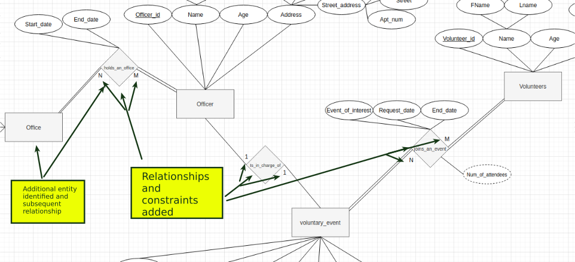

<h1 align="center"><strong>IFT 598 Project Report for Deliverable 2</strong></h1>

 A Project Report presented to the instructors of IFT 598 Middleware Programming and Database Security
 

By
 

<strong>GROUP 28</strong>
 

<em>Hooman Mishaeil - Group 28</em>

<em>IFT 598 Session C, Summer 2021</em>

<em>hmishaei@asu.edu</em>
 

<em>Jeffrey Ashworth - Group 28</em>

<em>IFT 598 Session C, Summer 2021</em>

<em>jdashwo2@asu.edu </em>
 
  
- [**Introduction**](#introduction)
- [**Description**](#description)
- [**User Manual**](#user-manual)
- [**Conclusion**](#conclusion)

# **Introduction**
  The IFT 598 "Middleware Programming and Database Security" project team was charged with completing "Deliverable 2"; interpreting a given set of requirements into a relational database schema and Structured Query Language (sql) scripts to create the database, tables, attributes with corresponding data types and relationships that will serve as the database for the course project. The results of which yielded a relational diagrams, relational table with constraints, a spreadsheet table listing the data types for entity attributes and a sql script to implement the relational database.  

   The team chose to again adhere closely to the provided requirements and continuing with the "IMPACT" volunteer organization. The team employed a methodical approach by first parsing the given requirements to determine the entities and attributes, including composite attributes and possible weak entities.  From here, the key attributes were identified and relations were developed to refine the initial diagrams. Once the Entity Relation (ER) diagram was created and included, entities, attributes, relations and constraints, the seven (7) step algorithm introduced in the course material was used to produce a relational mapping.  With the relational mapping and data types now depicting a complete schema, sql scripts were derived to construct the physical database.   Although there are many possible implementation paths the team could employ with the database design, the team used the requirements with little variation for the design.  Additional normalization was performed to provide scalability for the future project deliverables.  Examples will be provided in the Description section of this report to highlight alternative design considerations while describing in detail the implementation of the requirements.  The User Manual section of this report will detail the required steps to take the provided code and implement it locally and the Conclusion section will focus on 5 keys areas of reflection and improvement.

# **Description**
The team took an iterative approach to creating the diagrams.  Beginning with an analysis of the problem definition requirements.  The narrative was parsed and entities, attributes and relationships were identified.  After this initial pass for elemental identification, the tool Draw.io was used to depict the identified entities.  

After the entities were identified and added to the diagram, the associated attributes were included.  Composite attributes were also identified and added to the diagram as well as the initially identified key attributes for the entities. 

 
At this point, the team generated a spreadsheet to identify and capture the data types of the attributes.  Initially, general data types such as string and number were captured, however later, the team determined the appropriate data types and sizes for the MySql and added them for posterity.
Once the entities, attributes, and keys were added to the diagram, the relationships were included.  All relationships were determined to be binary form the requirements.  The constraints were identified and added to the diagram.  During this iteration, as mentioned in the introduction, the team made some design considerations to further normalize the design to include the "Office" and a relationship between "Officer" and "Office".  Other potential design considerations such as creating a normalized "Address" entity and look up tables for attributes like "state" would have been correct, but were deem unnecessary for this particular use case. 

 
Once the ER design was considered complete, the team set out to create the relational diagram using the ER-To-Relational Mapping Algorithm provided in the course materials.  Step one requires the mapping of regular entity types.  

 
Step 2 would then create a the relation for other entity types such as weak entities, however the design did not have any and the team moved to step 3, mapping binary 1:1 relationships.  The team chose to use the foreign key approach for the 1:1 relationship of "officer_in_charge" from "Officer". 

 
As the team's design did not include any 1:N relationships, in their design, the mapping of binary 1:N relationships was not required.  As the design included two binary M:N relationships, new relations were created and the primary keys of the participating entities were added as foreign keys.

 
Step 6 was not required as the design did not include multi-valued attributes nor was Step 7 implemented for any N-ary relationships would have been addressed with a relationship relations and *n* foreign keys.   Completed diagrams: 

 
Using the completed diagrams and data types table, the team set about creating a sql script to create the database on a MySql server.  The script includes all of the elements in the diagrams and when tested, on the team's local MySql server, created the database, created the tables (entities), columns (attributes), primary and foreign keys (relationships), and assigned data types to the fields.  While out of scope and not referenced for this deliverable, it should be noted that the team did test their database by populating the tables and running some basic queries to confirm data types and relationships.

# **User Manual**

The documents including two set of files. First, the relational diagram and constraint file which covers all the details about the entities, attributes, and any possible constraints. The items can be found in the relational_diagrams.pdf file.

The second set of files is the MySQL script which is being covered in impact_create_db.sql file and contains all the necessary SQL script to be executed to create the database tables.

To execute the script, first make sure you have installed MySQL server on the system and the credentials have been set up properly. After starting up MySQL server successfully, you can open up a database design tool such as MySQL Workbench, connect it to your local database server, and then in terminal section copy and paste all the script, finally from top menu choose Query and then hit the first Execute option.

After successful execution, you will see the tables list under "impact" schema.

# **Conclusion**
Deliverable 2, the design, documentation, and implementation of a working MySql database was successfully delivered by the team, Group 28.  While the team had some previous background in database, some aspects of the design process, including the concept of weak entities and the seven step algorithm were welcomed learning outcomes and aided in completing the deliverable.  The team also learned, database design requires and iterative approach and may take several iterations before a final implementation reveals itself.  The team faced a number of challenges, both in the design and technical implementation.  The design itself is somewhat subjective as well as the interpretation of the requirements.  To overcome the design challenges, the team asked clarifying questions to make the requirements and expectations more clear and made design decisions based on the known requirements and to provide a moderate level of future scalability.  The team encountered a technical challenge with the initial sql script where an error occurred during the creation of a table due to foreign key checks failing.  The team researched the issued and determined foreign key checks should be disabled for table and kep creation and enabled again at the end of the script.  While the team saw improvements in workflow when compared to the last deliverable, working asynchronously still prevents a challenge.  To improve this, the team will bolster its use of a task pull system to identify who is working what feature or issue.  

